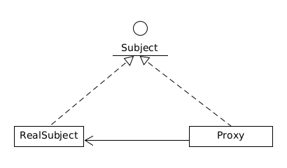
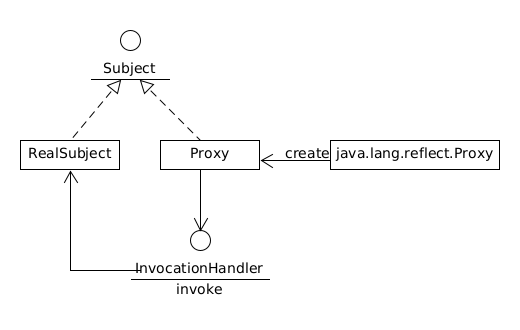

## 什么是代理（Proxy）

代理就是被代理对象的代表，代理具有被代理对象的所有能力，不然怎么代理呢？：) 代理分为静态和动态代理，下文将会分别介绍。

## 静态代理

代理具有被代理对象的能力则意味着他们具有同样的接口。


那什么是静态代理呢？就是这个代理类在程序运行前已经存在了，需要我们自己去实现一个代理类，需要经历编写编译这个过程。

## 动态代理

动态代理就是在程序运行时动态创建的。代理类将根据需求动态的创建出来，不需要我们自己来实现。

### Java如何实现动态代理

`Proxy`类提供了方法来动态的创建代理类。

```java
public static Object newProxyInstance(ClassLoader loader,
                                          Class<?>[] interfaces,
                                          InvocationHandler h)
```

为了能够创建代理类，我们需要告诉`Proxy`两样东西。
1. 这个要生成的代理类需要实现哪些接口
2. 这些接口中的方法的实现逻辑

接口中方法的实现逻辑是可变的，不同的需求对应不同的逻辑，这部分可变的内容被封装到了`InvocationHandler`中。
这样生成的代理类就会实现指定的接口，接口的方法实现就是调用`InvocationHandler`中的`invoke`方法。

```java
public interface InvocationHandler {
    public Object invoke(Object proxy, Method method, Object[] args)
        throws Throwable;
}
```
当调用生成的proxy实例上的方法时，生成的proxy class会把被调用的方法信息都封装起来传给invoke方法， 这样`InvocationHandler`可以做任何逻辑在这里。通常`InvocationHandler`将会调用被代理对象的方法来达到代理的目的。




## 动态代理在mybatis中的应用

如果你在用mybatis这个持久化框架的话，你一定用过Mapper。Mapper只是一个接口，当你从`SqlSession`中获得一个Mapper时，Mybatis 会调用`java.lang.reflect.Proxy`来生成一个实现了这个Mapper的代理类。

```java

public class MapperProxy<T> implements InvocationHandler, Serializable {
    ...
}

public class MapperProxyFactory<T> {
    ...
    protected T newInstance(MapperProxy<T> mapperProxy) {
        return (T) Proxy.newProxyInstance(mapperInterface.getClassLoader(), new Class[] { mapperInterface }, mapperProxy);
    }
  ...
}

```


