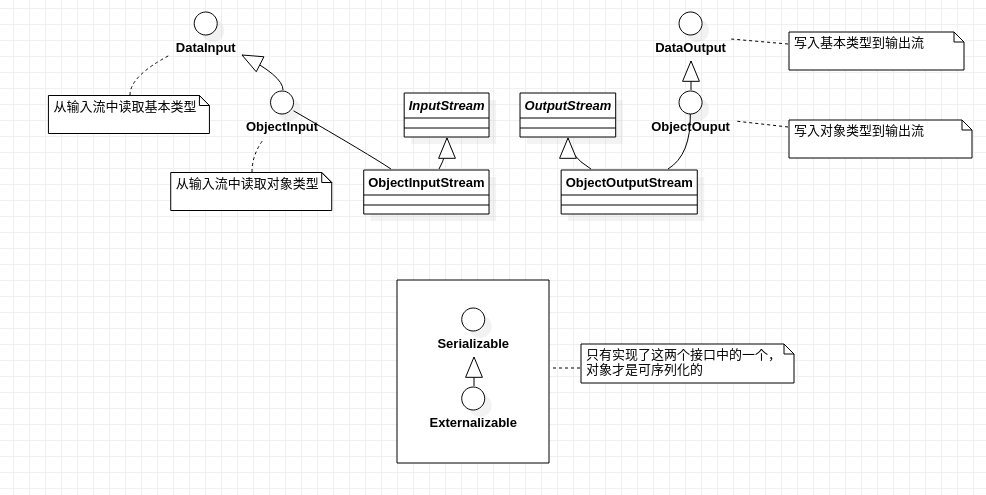
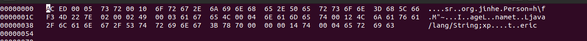

## 前言

一直好奇Java本身的序列化机制是怎么工作的，抽空看了下[java object serialization specification](https://docs.oracle.com/javase/8/docs/platform/serialization/spec/serialTOC.html) 和JDK 序列化源码，终于知道了它的工作原理：）， 很简单。

## 系统架构

一图胜千言。



1. DataInput/DataOutput 用来序列化/反序列化基本数据类型。
2. ObjectInput/ObjectOutput 用来序列化/反序列化对象类型。

## 对象可序列化的条件

1. 实现`Serializable`, 或者
2. 实现`Externalizable`

`Serializable`只是一个标记接口。

## 如何参与对象的序列化

Java序列化框架提供了扩展方法允许参与对象的序列化过程。

###  `Serializable`对象序列化的定制

```java
  private void readObject(java.io.ObjectInputStream stream)
      throws IOException, ClassNotFoundException;
  private void writeObject(java.io.ObjectOutputStream stream)
      throws IOException
  private void readObjectNoData()
      throws ObjectStreamException;
```
一个`Serializable`对象可以实现上面的方法来参与对象的序列化，它只需要关注自身字段的序列化，不必关注父类中的字段。

###  `Externalizable`对象序列化的定制

```java
public interface Externalizable extends java.io.Serializable {
    
    void writeExternal(ObjectOutput out) throws IOException;
    void readExternal(ObjectInput in) throws IOException, ClassNotFoundException;
}

```

一旦对象是`Externalizable`则意味着对象的序列化和反序列化完全有对象本身来负责，由对象来决定哪些字段需要序列化，而且也要负责父类中字段的序列化，JDK的序列化机制只是将对象的类信息写入输出流中，对象的状态信息完全交给对象本身负责。

## 序列化字节流协议

所谓协议就是一种契约来描述字节流中对象的信息是如何组织的，序列化流程按照这个协议来写入数据，反序列化流程根据这个协议来读取数据。

### 协议的设计目标

1. 数据精简
2. 高效的读
4. 支持对象（类）的演进（如增加字段）

### 协议的内容

协议规定了基本数据类型，字符串，数组， 对象等在字节流中的格式，具体内容参考官方的规范吧。下面将会用一个例子来演示对象序列化后在字节流中的形态。

## 对象序列化后字节流解析

### 样例对象序列化到文件

```java
package org.jinhe;

import java.io.Serializable;
import java.util.Objects;

public class Person implements Serializable {

    private static final long serialVersionUID = 4424888231129850494L;

    //3D 68 5C 66 F3 4D 22 7E

    private String name;
    private int age;

    public Person(String name, int age) {
        this.name = name;
        this.age = age;
    }

    public String getName() {
        return name;
    }

    public int getAge() {
        return age;
    }

    @Override
    public boolean equals(Object o) {
        if (this == o) return true;
        if (o == null || getClass() != o.getClass()) return false;
        Person person = (Person) o;
        return age == person.age &&
                Objects.equals(name, person.name);
    }

    @Override
    public int hashCode() {
        return Objects.hash(name, age);
    }
}

package org.jinhe;

import java.io.*;

public class JDKSerializer {
    //serialize
    public byte[] to(Person person) throws IOException {
        ByteArrayOutputStream byteArrayOutputStream = new ByteArrayOutputStream();
        ObjectOutputStream stream = new ObjectOutputStream(byteArrayOutputStream);
        stream.writeObject(person);
        stream.close();
        return byteArrayOutputStream.toByteArray();
    }

    public void to(Person person, OutputStream outputStream) throws IOException {
        ObjectOutputStream stream = new ObjectOutputStream(outputStream);
        stream.writeObject(person);
        stream.close();
    }

    //deserialize
    public Person from(byte[] bytes) throws IOException, ClassNotFoundException {
        ObjectInputStream objectInputStream = new ObjectInputStream(new ByteArrayInputStream(bytes));
        Person person = (Person) objectInputStream.readObject();
        objectInputStream.close();
        return person;
    }

    public static void main(String[] args) throws IOException, ClassNotFoundException {
        Person person = new Person("eric", 20);
        JDKSerializer jdkSerializer = new JDKSerializer();

        jdkSerializer.to(person, new FileOutputStream("person.out"));

        System.out.println(Long.toHexString(4424888231129850494L));

    }
}

```

### 字节流解析



AC ED - magic number,占两个字节，表明是一个序列化字节流

00 05 - 字节流版本号,占两个字节

73 - 表明要写入的是一个对象， TC_OBJECT

72 - 表明要写入类描述，TC_CLASSDESC

00 10 - 16， Person 类名长度

6F 72 67 2E  6A 69 6E 68  65 2E 50 65  72 73 6F 6E - org.jinhe.Person， Person类名

3D 68 5C 66 F3 4D 22 7E - 4424888231129850494，serialVersionUID

02 - 标记位，表明对象的类是否是Serializable/Externalizable/Enum, 是否定义了writeOjbect， 02 对应SC_SERIALIZABLE表明该类实现了Serializable接口

00 02 - 可序列化字段数量， 占用2个字节，因为只有name和age两个字段，所以对应00 02.

49 - 字段类型，**age**是整型，对应的类型是I

00 03 - 字段名的长度， 占两个字节。**age**三个字符所以是00 03

61 67 65 - 字段名**age**

4C - L, name是String类型，属于对象类型，用L表示

00 04 - 字段名的长度， 占两个字节。**name**四个字符所以是00 04

6E 61 6D 65 - 字段名**name**

74 - 具体的字符串类型，TC_STRING

00 12 - 类型的长度18 （**Ljava/lang/String;** - 18个字符）

4C  6A 61 76 61 2F 6C 61 6E 67 2F 53 74 72 69 6E 67 3B - 类名**Ljava/lang/String;**

78 - TC_ENDBLOCKDATA, 可选数据块结束

70 - Null, Person没有父类，所以父类的类型信息为Null

00 00 00 14 - age 为20

74 - 字段类型为字符串，TC_STRING

00 04 - name字段包含的字符串长度为4

65 72  69 63 - eric（name字段的值）

通过分析发现，字节流中首先包含类的描述，然后是实例的数据。对字符串的序列化，首先用几位来表示字符串的长度，然后后面跟着字符串的内容。

## serialVersionUID 的作用

当反序列化时，字节流中的serialVersionUID 会和对应的反序列化类声明中的serialVersionUID作比较，如果不一致，反序列化会失败。
